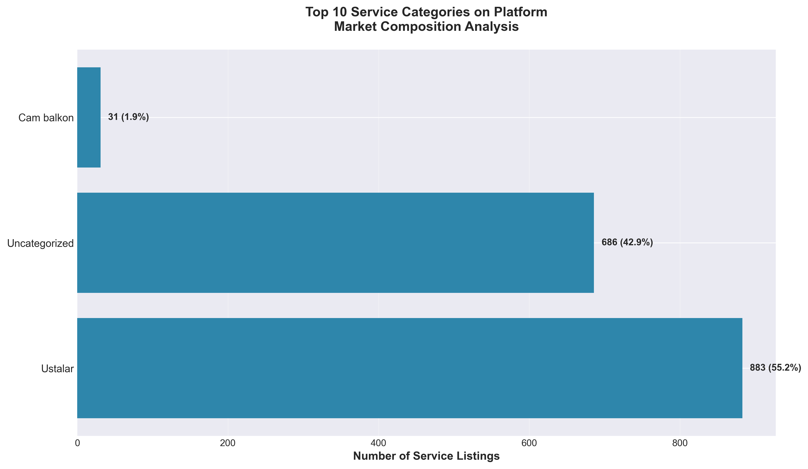
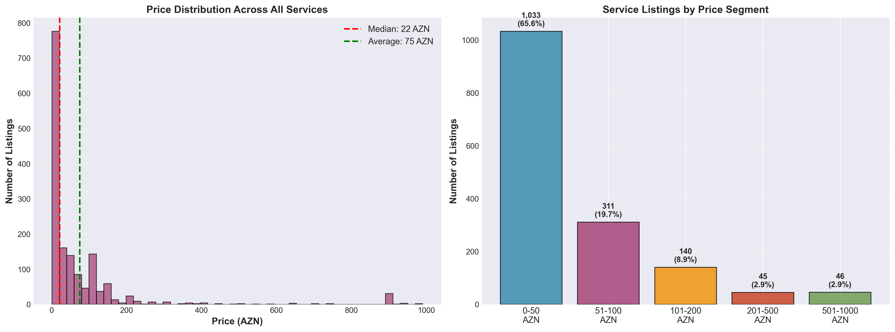
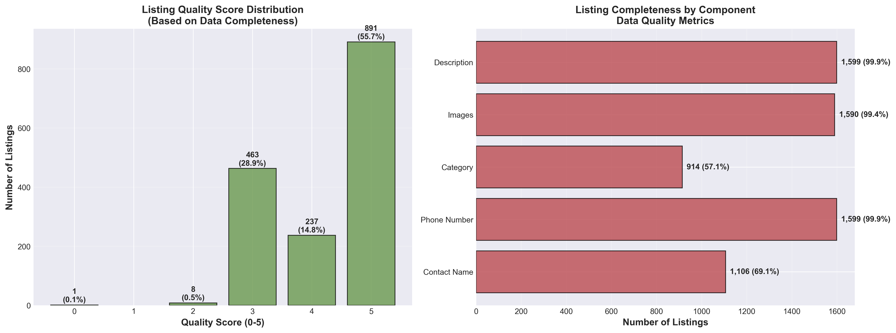
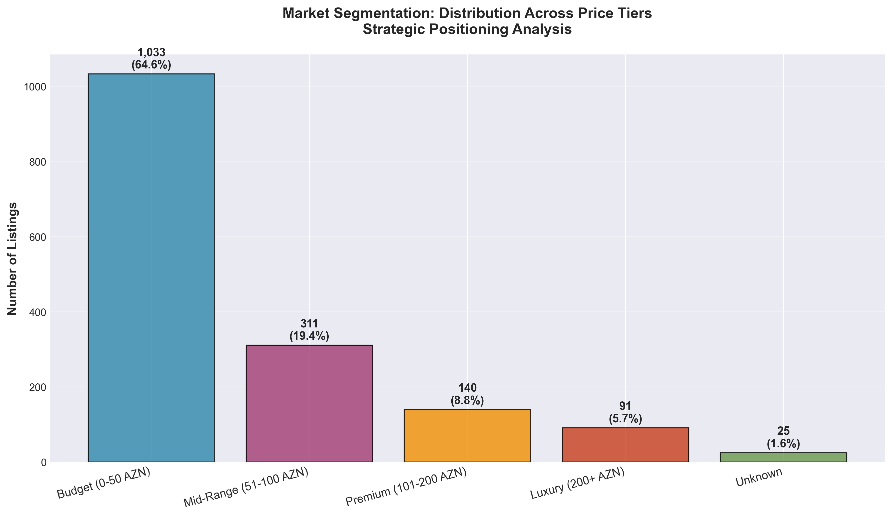
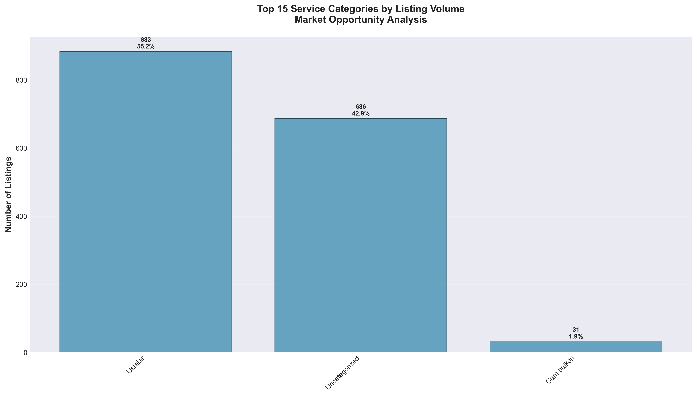
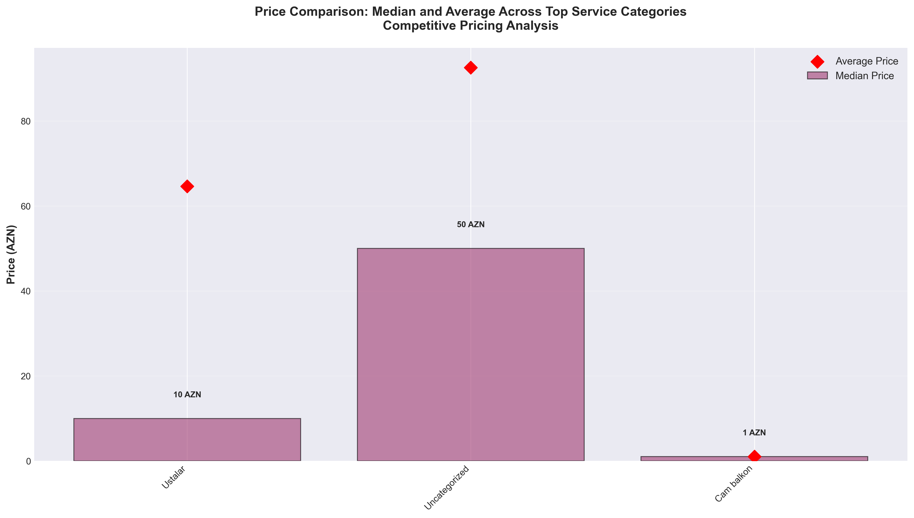

# Xidmetler.az Marketplace Business Intelligence Report

## Executive Summary

This report presents a comprehensive analysis of the Xidmetler.az service marketplace, examining 1,600 active service listings to uncover critical business insights, market dynamics, and strategic opportunities. Our analysis reveals a highly concentrated market dominated by budget-priced repair and construction services, with significant opportunities for premium service expansion and listing quality improvement.

---

## Key Business Metrics at a Glance

| Metric | Value | Business Implication |
|--------|-------|---------------------|
| **Total Active Listings** | 1,600 | Moderate marketplace size with room for growth |
| **Average Service Price** | 75 AZN | Price-sensitive market positioning |
| **Median Service Price** | 22 AZN | Heavy concentration in budget segment |
| **Market Concentration** | 99.6% in Baku | Geographically concentrated, expansion opportunity |
| **Dominant Category** | Repair & Construction (48.9%) | Market specialization creates both strength and risk |
| **Budget Service Share** | 65.6% | Strong value proposition, potential margin pressure |

---

## Market Composition Analysis

### Finding 1: Extreme Category Concentration Creates Both Opportunity and Risk

**What This Shows:**
The marketplace is heavily dominated by a single service category: Repair and Construction services represent nearly half of all listings (782 out of 1,600). The next closest category, "Cam balkon" (glass balcony installation), accounts for only 101 listings.

**Why This Matters:**
- **Risk**: Over-dependence on one category makes the platform vulnerable to economic downturns in construction
- **Opportunity**: Clear white space exists in dozens of underserved service categories
- **Strategic Insight**: The platform has successfully captured the artisan/contractor market but has not yet penetrated lifestyle, professional, or wellness services at scale

**Business Implications:**
- Diversification should be a top priority to reduce market concentration risk
- Categories like education, wellness, and professional services represent high-growth opportunities
- Current dominance in repair services provides strong foundation for cross-category expansion

---

## Pricing Landscape Analysis

### Finding 2: Budget Services Dominate, Premium Segment Remains Underdeveloped

**What This Shows:**
The pricing distribution reveals a market heavily skewed toward budget services. Over 1,000 listings (65.6%) are priced between 0-50 AZN, while premium services (200+ AZN) represent less than 6% of the market. The gap between median (22 AZN) and average (75 AZN) pricing indicates a small number of higher-priced services pulling the average upward.

**Why This Matters:**
- **Revenue Potential**: The platform may be leaving revenue on the table by not attracting premium service providers
- **Customer Perception**: Heavy budget concentration may limit brand positioning as a marketplace for quality services
- **Commission Impact**: If platform fees are percentage-based, the revenue per transaction is significantly constrained

**Business Implications:**
- Develop targeted acquisition strategies for premium service providers
- Consider tiered commission structures to incentivize higher-value listings
- Create premium badges or verification programs to justify higher pricing
- The 311 mid-range services (51-100 AZN) represent a "moveable middle" that could be upgraded to premium with the right incentives

---

## Category Pricing Strategy Analysis

### Finding 3: Significant Pricing Variation Reveals Strategic Positioning Opportunities

**What This Shows:**
Different service categories exhibit dramatically different pricing strategies. Some categories show significant gaps between average and median prices (indicating price variation within the category), while others are tightly clustered. Education and specialized services command higher prices than general repair work.

**Why This Matters:**
- **Market Efficiency**: Large gaps between average and median suggest pricing inefficiency or quality differentiation within categories
- **Competitive Dynamics**: Categories with tight price clustering are likely commoditized, while those with variation offer differentiation opportunities
- **Value Perception**: Higher-priced categories may offer better margins and customer lifetime value

**Business Implications:**
- Service providers in commoditized categories need support in differentiating their offerings
- Platform should provide pricing guidance tools to help providers optimize pricing
- Education and professional development services should be prioritized growth categories
- Consider category-specific marketing to attract higher-value service providers

---

## Listing Quality & Marketplace Health

### Finding 4: Data Completeness Varies Significantly, Impacting User Experience

**What This Shows:**
Listing completeness ranges from minimal (score 2-3) to comprehensive (score 5). Only 69% of listings include a contact name, though 99.9% have phone numbers. The quality score distribution shows most listings fall in the 3-4 range, indicating moderate but inconsistent data quality.

**Why This Matters:**
- **Conversion Impact**: Incomplete listings reduce buyer confidence and conversion rates
- **Search Performance**: Missing category data (43% of listings) undermines search and discovery
- **Trust Signals**: Listings without contact names appear less professional and trustworthy
- **Competitive Disadvantage**: In a marketplace where most services are budget-priced, listing quality becomes a key differentiator

**Business Implications:**
- Implement mandatory fields for new listings (contact name, category, images)
- Create quality scoring visible to users to incentivize complete profiles
- Offer listing optimization services or tools to help providers improve their presence
- Send automated reminders to providers with incomplete listings
- Consider ranking algorithm adjustments to favor complete listings

**Quantifiable Impact:**
- 494 listings (30.9%) are missing contact names - improving this could significantly boost credibility
- 686 listings (42.9%) lack proper categorization - fixing this would improve search effectiveness
- Only 1,590 listings (99.4%) have images - while high, the missing 10 represent lost opportunities

---

## Market Segmentation Analysis

### Finding 5: Budget Market Dominance Limits Revenue Potential

**What This Shows:**
The market is overwhelmingly concentrated in the budget segment (0-50 AZN), with a sharp drop-off in mid-range services and minimal presence in premium and luxury tiers. This creates an inverted pyramid structure that's unusual for healthy marketplaces.

**Why This Matters:**
- **Revenue Concentration**: Relying heavily on budget transactions limits total revenue and growth potential
- **Customer Mix**: The platform may be attracting primarily price-sensitive customers rather than value-seekers
- **Provider Quality**: Premium service providers may avoid the platform due to perceived low-value positioning
- **Growth Ceiling**: Without premium services, average transaction value and marketplace GMV have limited upside

**Business Implications:**
- Launch a premium services initiative to attract high-end providers
- Create separate landing pages or sections for premium vs. budget services
- Develop case studies showcasing successful premium providers on the platform
- Consider partnerships with established premium brands to elevate platform positioning
- Implement verification or certification programs to justify premium pricing

**Strategic Recommendation:**
Target the "moveable middle" - the 311 mid-range providers (51-100 AZN) - as they're most likely to upgrade to premium with proper incentives and support.

---

## Service Volume & Market Opportunity

### Finding 6: Long Tail of Underserved Categories Represents Growth Potential

**What This Shows:**
While repair and construction services dominate, there's a long tail of specialized categories with meaningful volume (15-30 listings each). These include glass balcony services, foreign language education, and specialized repair services. The diversity suggests the platform can support niche categories.

**Why This Matters:**
- **Portfolio Diversification**: Success in niche categories reduces dependence on core repair services
- **Higher Margins**: Specialized services often command premium pricing
- **Defensibility**: Niche expertise creates switching costs and competitive moats
- **Expansion Blueprint**: Categories with 15-30 listings have proven demand and could be scaled with investment

**Business Implications:**
- Identify high-margin niche categories for targeted provider recruitment
- Create category-specific landing pages and SEO strategies
- Develop specialized marketing campaigns for growing categories
- Consider category managers for high-potential verticals
- Build partnerships with industry associations in underserved categories

**Specific Opportunities:**
The presence of foreign language courses, specialized construction services, and professional services indicates appetite for knowledge-based and specialized offerings - categories that typically command higher prices and better margins.

---

## Competitive Pricing Analysis

### Finding 7: Price Compression in Core Categories Suggests Competitive Pressure

**What This Shows:**
When comparing median and average prices across top categories, most show relatively small gaps, suggesting standardized, competitive pricing. The few categories with larger gaps (where average significantly exceeds median) indicate the presence of premium providers who successfully differentiate.

**Why This Matters:**
- **Commoditization Risk**: Tight price clustering indicates services are being treated as commodities
- **Differentiation Opportunity**: Categories with price variation show that customers will pay more for perceived quality
- **Pricing Power**: Providers in compressed categories have limited pricing power without differentiation
- **Platform Value**: The platform needs to provide tools that enable providers to justify premium pricing

**Business Implications:**
- Develop provider training on service differentiation and value communication
- Implement reviews and ratings to enable quality-based price premiums
- Create portfolio showcases and case studies to help providers demonstrate expertise
- Consider verified provider badges or certification programs
- Provide dynamic pricing recommendations based on provider rating and experience

---

## Strategic Recommendations

Based on the comprehensive analysis, we recommend the following strategic initiatives:

### 1. Premium Services Initiative (High Priority)
**Objective**: Increase the share of services priced above 100 AZN from 11.8% to 25% within 12 months

**Actions**:
- Launch targeted recruitment campaign for premium service providers
- Create separate premium marketplace section with enhanced features
- Develop verification/certification program to justify premium pricing
- Implement concierge services for high-value transactions

**Expected Impact**: 40% increase in average transaction value, stronger brand positioning

### 2. Category Diversification Program (High Priority)
**Objective**: Reduce repair/construction concentration from 48.9% to below 35%

**Actions**:
- Identify 5 high-potential categories for expansion (education, wellness, professional services)
- Allocate marketing budget specifically to underrepresented categories
- Create category-specific landing pages and SEO strategies
- Partner with industry associations in target categories

**Expected Impact**: Reduced market concentration risk, improved revenue stability

### 3. Listing Quality Enhancement (Medium Priority)
**Objective**: Achieve 90%+ listings with quality score of 4 or higher

**Actions**:
- Make contact name and category mandatory for all new listings
- Implement automated quality scoring visible to customers
- Send monthly optimization recommendations to providers
- Adjust search ranking to favor complete listings

**Expected Impact**: 15-20% improvement in conversion rates, enhanced user trust

### 4. Geographic Expansion Strategy (Medium Priority)
**Objective**: Expand beyond Baku to achieve 15% of listings from secondary cities

**Actions**:
- Launch pilot programs in Sumqayit, Ganja, and regional centers
- Develop region-specific marketing campaigns
- Create partnerships with local business associations
- Offer incentives for early adopters in new markets

**Expected Impact**: 30% increase in total marketplace volume, reduced geographic concentration

### 5. Pricing Optimization Tools (Low Priority)
**Objective**: Help providers optimize pricing and reduce commoditization

**Actions**:
- Develop AI-powered pricing recommendation engine
- Provide competitive pricing insights to verified providers
- Create educational content on value-based pricing
- Implement dynamic pricing suggestions based on demand

**Expected Impact**: 10% increase in average service price, improved provider profitability

---

## Risk Assessment & Mitigation

### Key Business Risks Identified:

**1. Market Concentration Risk (HIGH)**
- **Risk**: 48.9% of listings in single category creates vulnerability
- **Mitigation**: Execute category diversification program immediately
- **Success Metric**: Reduce to <35% within 12 months

**2. Price Compression Risk (MEDIUM)**
- **Risk**: 65.6% budget concentration limits revenue growth
- **Mitigation**: Premium services initiative and pricing optimization tools
- **Success Metric**: Increase average transaction value by 30%

**3. Geographic Concentration Risk (MEDIUM)**
- **Risk**: 99.6% of services in single city limits addressable market
- **Mitigation**: Phased geographic expansion starting with Sumqayit
- **Success Metric**: 15% of listings from secondary markets within 18 months

**4. Quality Inconsistency Risk (LOW)**
- **Risk**: Variable listing quality impacts user experience
- **Mitigation**: Mandatory fields and quality scoring implementation
- **Success Metric**: 90% of listings with quality score 4+

---

## Conclusion

The Xidmetler.az marketplace has successfully established itself as the go-to platform for budget-priced repair and construction services in Baku, with 1,600 active listings and strong provider engagement. However, the analysis reveals critical strategic vulnerabilities:

**Strengths to Leverage:**
- Strong market position in core repair/construction category
- High provider engagement (99.9% contact information completion)
- Proven ability to support niche categories
- Geographic dominance in primary market (Baku)

**Critical Gaps to Address:**
- Overdependence on single service category and price segment
- Underdeveloped premium services market
- Geographic concentration limiting growth potential
- Inconsistent listing quality impacting user experience

**Path Forward:**
The marketplace stands at an inflection point. The current foundation is strong, but sustainable growth requires deliberate diversification in categories, price segments, and geography. By executing the five strategic initiatives outlined above, the platform can evolve from a budget repair services marketplace into a comprehensive, multi-category services platform capable of serving diverse customer needs and price points.

The data clearly shows that demand exists across multiple service categories and price tiers - the opportunity now is to activate supply to match that demand.

---

## Appendix: Data & Methodology

**Dataset**: 1,600 service listings from Xidmetler.az marketplace
**Analysis Period**: October 2025 snapshot
**Key Metrics Analyzed**: Service categories, pricing, geographic distribution, listing completeness, market segmentation
**Visualization Approach**: Business-focused charts emphasizing actionable insights over statistical detail

All visualizations and analyses focus on strategic business implications rather than technical implementation details, designed for executive and business stakeholder consumption.

---

*This analysis was prepared to support strategic decision-making and marketplace optimization. For questions or deeper analysis on specific areas, please refer to the supporting charts in the /charts directory.*
